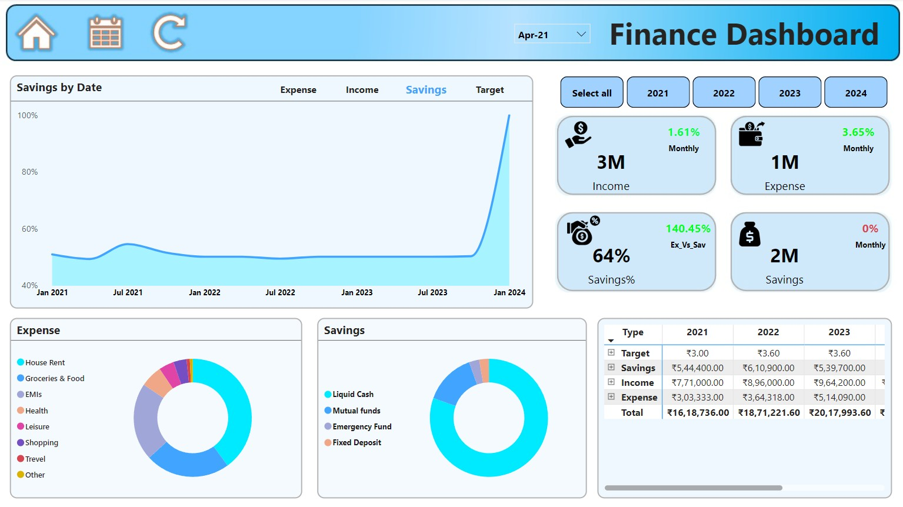

# Finance Dashboard

## Overview
This Finance Dashboard is a data visualization project created using **Power BI**. It helps track and analyze personal financial data such as income, expenses, savings, and targets over time. The dashboard provides actionable insights into financial habits, savings goals, and trends.

## Features
- **Savings Trend**: Visual representation of savings progress over time.
- **Expense Breakdown**: Categorized pie chart of expenditures, including:
  - House Rent
  - Groceries & Food
  - EMIs
  - Health
  - Leisure, Shopping, Travel, and more.
- **Savings Distribution**: A breakdown of savings into liquid cash, mutual funds, emergency funds, and fixed deposits.
- **Key Metrics**:
  - Income and Expense tracking.
  - Monthly savings percentage.
  - Savings vs. Targets comparison.

## Tools and Technologies
- **Power BI**: Used to create the interactive dashboard.
- **Excel**: Processed and prepared the dataset for visualization.

## Screenshot


## About the Dataset
The data used for this project is fictional and created for demonstration purposes. You can replace it with your own data to suit your requirements.

## License
This project is licensed under the MIT License. See the [LICENSE](./LICENSE) file for details.

## Feedback and Contributions
Feel free to provide feedback or contribute to the project by submitting a pull request. Let’s collaborate to make this dashboard even better!


---

#### **`LICENSE` File (MIT License)**
```plaintext
MIT License

Copyright (c) 2025 [Mithun Adhe]

Permission is hereby granted, free of charge, to any person obtaining a copy
of this software and associated documentation files (the "Software"), to deal
in the Software without restriction, including without limitation the rights
to use, copy, modify, merge, publish, distribute, sublicense, and/or sell
copies of the Software, and to permit persons to whom the Software is
furnished to do so, subject to the following conditions:

The above copyright notice and this permission notice shall be included in all
copies or substantial portions of the Software.

THE SOFTWARE IS PROVIDED "AS IS", WITHOUT WARRANTY OF ANY KIND, EXPRESS OR
IMPLIED, INCLUDING BUT NOT LIMITED TO THE WARRANTIES OF MERCHANTABILITY,
FITNESS FOR A PARTICULAR PURPOSE AND NONINFRINGEMENT. IN NO EVENT SHALL THE
AUTHORS OR COPYRIGHT HOLDERS BE LIABLE FOR ANY CLAIM, DAMAGES OR OTHER
LIABILITY, WHETHER IN AN ACTION OF CONTRACT, TORT OR OTHERWISE, ARISING FROM,
OUT OF OR IN CONNECTION WITH THE SOFTWARE OR THE USE OR OTHER DEALINGS IN THE
SOFTWARE.


