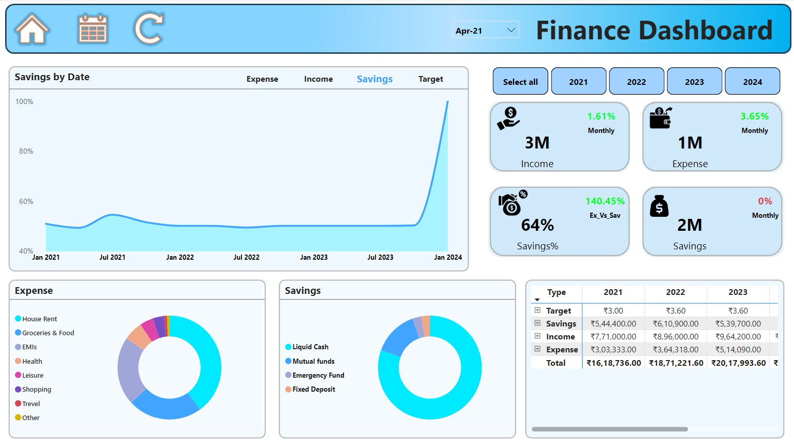

# 💰 Personal Finance Analytics Dashboard (Power BI Project)

An interactive **Power BI Finance Dashboard** designed to track income, expenses, and savings trends and turn financial data into meaningful insights.

This project demonstrates real-world **data analytics, data storytelling, and dashboard design skills** using Power BI.

---

# 📌 Project Overview

Managing finances without clear visibility often leads to overspending and poor saving habits.  
This project transforms raw financial data into a **modern, interactive dashboard** that helps users understand:

- Where money is coming from 💵  
- Where money is going 💸  
- How savings are growing 📈  
- How close financial goals are 🎯  

The dashboard provides **data-driven insights** to support smarter financial decisions.

---

# ❗ Problem Statement

Many people track finances in spreadsheets but struggle to:

- Understand spending behavior
- Track savings growth over time
- Compare income vs expenses
- Monitor financial targets
- Make informed budgeting decisions

Raw spreadsheets lack **visual storytelling** and trend analysis.  
This project solves the problem using **Power BI interactive visualizations.**

---

# 🎯 Project Objectives

The main goals of this project were to:

- Analyze income, expenses, savings, and targets
- Track financial trends over multiple years
- Identify major expense categories
- Visualize savings allocation strategies
- Build a professional dashboard suitable for real-world use
- Demonstrate Power BI, DAX, and data analysis skills

---

# 📊 Dataset Information

📂 **Dataset Source:** Self-created financial dataset (Excel)

The dataset simulates real-world personal finance data including:

- Monthly income records
- Expense categories and amounts
- Savings contributions
- Savings allocation types
- Year-wise financial summary (2021–2024)

⚠️ Note: Data is fictional and created for demonstration purposes.  
You can replace it with your own financial data.

---

# 🛠️ Tools & Technologies Used

| Tool | Purpose |
|------|--------|
| **Power BI** | Dashboard creation & visualization |
| **Excel** | Data cleaning & preparation |
| **DAX** | Measures & calculated metrics |
| **Data Modeling** | Relationships & KPI calculations |

---

# 🔄 Project Workflow

1️⃣ Data Collection (Excel dataset)  
2️⃣ Data Cleaning & Formatting  
3️⃣ Data Modeling in Power BI  
4️⃣ DAX Measures Creation  
5️⃣ Dashboard Design & UI Layout  
6️⃣ Insights Generation  
7️⃣ Presentation & Documentation  

---

# 🧹 Data Cleaning & Preparation

Key preprocessing steps included:

- Removing duplicate and null records
- Standardizing date and currency formats
- Creating calculated columns and measures:
  - Savings %
  - Expense vs Savings Ratio
  - Monthly Growth Metrics
- Building relationships between tables

---

# 🔍 Exploratory Data Analysis (EDA)

EDA focused on answering key financial questions:

- How are savings changing over time?
- Which categories drive most expenses?
- Is income growing consistently?
- How effectively is money being saved?
- How is savings distributed across investments?

---

# 📈 Key Insights & Findings

### 💵 Financial Performance
- Income shows **steady year-over-year growth**
- Monthly expenses remain **stable and controlled**
- Savings rate reached an impressive **64%**
- Achieved **2M total savings milestone**
- Efficient budgeting with **140% Expense vs Savings ratio**

### 🏠 Expense Insights
Major spending areas:
- House Rent (largest expense)
- Groceries & Food (essential spending)
- EMIs and Health expenses
- Leisure & Travel (lifestyle spending)

💡 Opportunity: Reduce discretionary spending to increase savings.

### 📊 Savings Strategy Insights
Savings are diversified into:
- Liquid Cash → Immediate access
- Mutual Funds → Growth investments
- Emergency Fund → Risk protection
- Fixed Deposits → Stable returns

---

# 📊 Dashboard Features

## 🔹 KPI Cards
Quick financial snapshot:
- Total Income
- Total Expenses
- Savings %
- Total Savings

## 🔹 Savings Trend Analysis
Time-series visualization showing savings growth from **2021–2024**

## 🔹 Expense Breakdown
Donut chart showing category-wise expenses:
- House Rent
- Groceries & Food
- EMIs
- Health
- Leisure & Travel
- Shopping & Others

## 🔹 Savings Allocation
Breakdown of investment distribution.

## 🔹 Dynamic Year Filter
Interactive filtering for 2021–2024 analysis.

## 🔹 Financial Summary Table
Year-wise comparison of:
- Income
- Expenses
- Savings
- Targets

---

# ✅ Final Outcome

A modern and interactive dashboard that:

✔ Improves financial visibility  
✔ Supports budgeting decisions  
✔ Demonstrates strong Power BI skills  
✔ Showcases data storytelling ability  

---

# 💼 Real-World Value

This dashboard can be used by:

- Individuals managing personal finances
- Financial advisors analyzing clients
- Households planning budgets
- Small businesses tracking cash flow

**Business Benefits:**
- Better financial awareness
- Smarter budgeting decisions
- Increased savings potential
- Data-driven planning

---

# 🚀 Future Improvements

Planned upgrades:

- Add forecasting & predictive analytics
- Connect live financial data sources
- Add mobile responsive layout
- Automate data refresh using Python
- Add anomaly detection for unusual spending

---

# ▶️ How to Use

1. Download this repository
2. Open **Power BI Desktop**
3. Open the file:

Finance_Dashboard.pbix

4. Click **Refresh Data**
5. Explore the dashboard using filters & slicers

---

# 📁 Project Structure

Finance-Dashboard/
│
├── Data/
│ └── Finance Dataset.xlsx
│
├── PowerBI/
│ ├── Finance_Dashboard.pbix
│ └── measure.pbix
│
├── Presentation/
│ ├── Finance_Dashboard_Presentation.pdf
│ └── Finance_Dashboard_Presentation.pptx
│
├── Media/
│ └── Dashboard Recording.mp4
│
└── README.md

---

# 🖼️ Dashboard Screenshot

---

# 👨‍💻 Author

**Mithun Adhe**  
Data Analyst | Power BI Developer  

🔗 GitHub: https://github.com/MithunAdhe

---

⭐ If you like this project, consider giving it a star!
